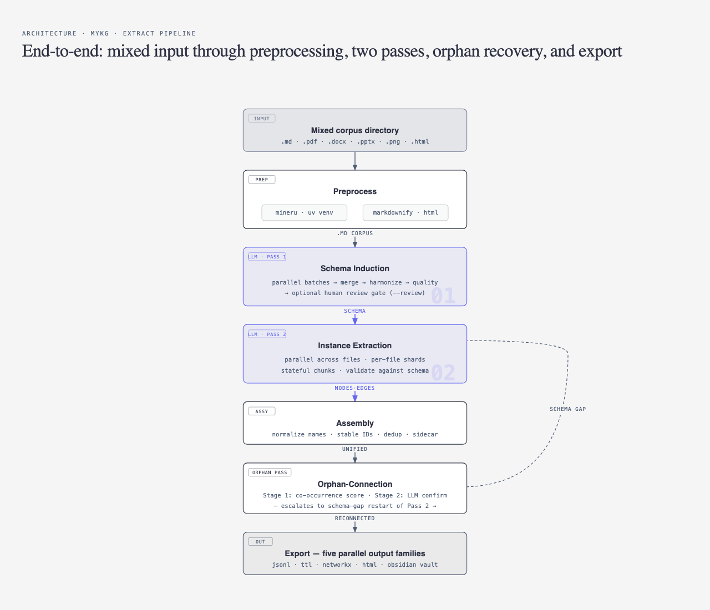
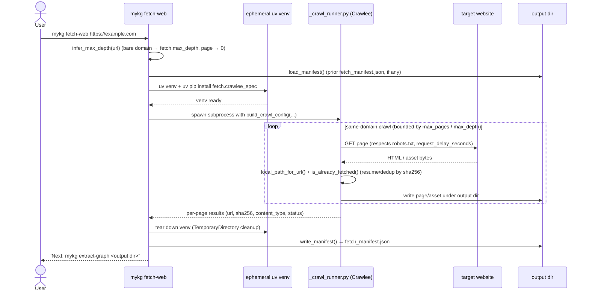
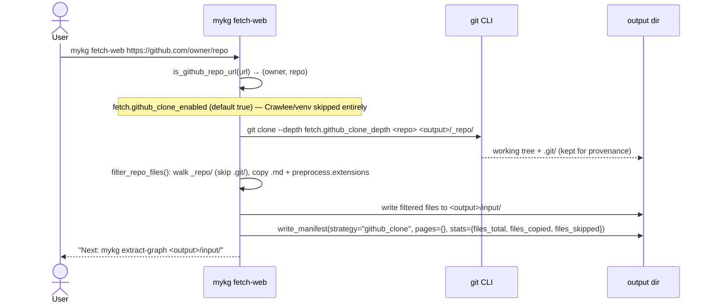
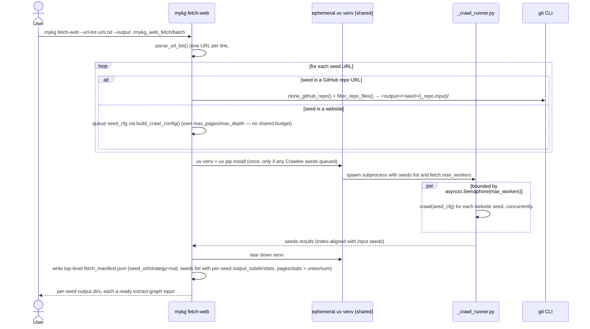
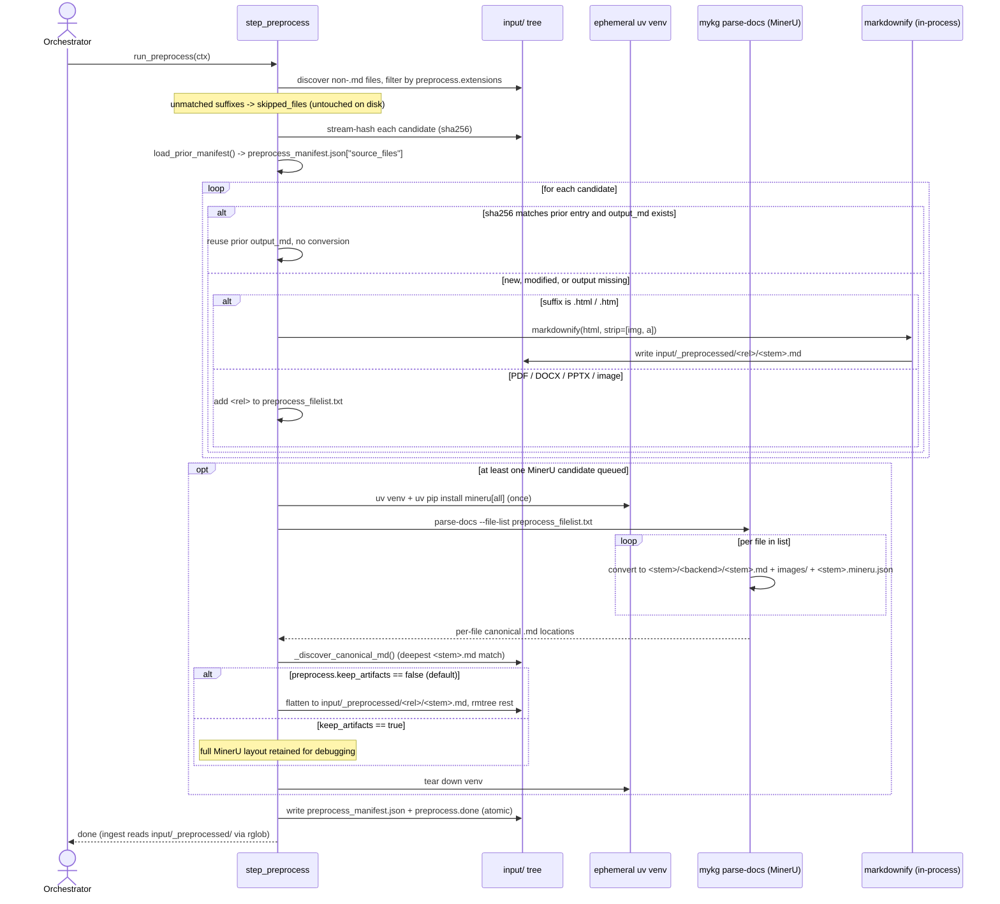
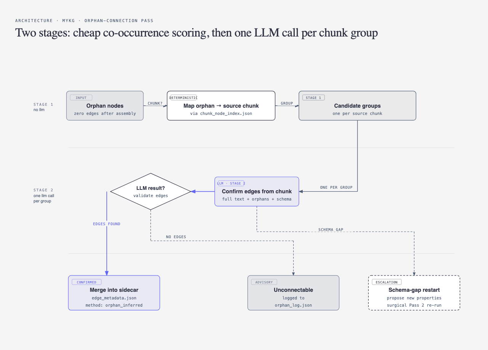

# myKG — Architecture and Design

This document explains how **myKG** works at a conceptual level: the pipelines, the key stages, the data it produces, and the design choices behind it. For command-line usage and options, see [README.md](README.md).

---

## Contents

- [System Overview](#system-overview)
- [Orchestrator](#orchestrator)
- [Extract Pipeline Steps](#extract-pipeline-steps)
- [Merge Pipeline Steps](#merge-pipeline-steps)
- [Website and Repo Fetching (`mykg fetch-web`)](#website-and-repo-fetching-mykg-fetch-web)
- [Extract Pipeline](#extract-pipeline)
  - [Pass 1: Schema Induction](#pass-1-schema-induction)
  - [Pass 2: Instance Extraction](#pass-2-instance-extraction)
  - [Assembly and Deduplication](#assembly-and-deduplication)
  - [Orphan-Connection Pass](#orphan-connection-pass)
  - [Name Normalization](#name-normalization)
- [Merge Pipeline](#merge-pipeline)
- [Output Formats](#output-formats)
- [Resumability and Re-entry](#resumability-and-re-entry)
- [Re-entry Points](#re-entry-points)
- [Correction Model](#correction-model)
- [LLM Provider Support](#llm-provider-support)
- [Key Design Decisions](#key-design-decisions)

---

## System Overview

**myKG** provides two independent pipelines, both producing the same three output formats (JSONL, Turtle RDF, and NetworkX):

| Command | What it does |
|---|---|
| `mykg extract-graph <dir>` | Reads Markdown files, induces a schema, extracts entities and relationships, and exports the graph |
| `mykg merge-graphs <A> <B>` | Combines two independently-produced sessions into one unified knowledge graph |
| `mykg fetch-web <url>` | Crawls a website (or shallow-clones a GitHub repo) into a local folder that is a ready-made `extract-graph` input |

Both pipelines run as a sequence of named steps. All intermediate state is written to disk after every step, so any step can be re-entered without repeating upstream work.

The LLM layer is provider-pluggable: six adapters ship out of the box (Anthropic, OpenAI, Ollama, OpenRouter, Claude CLI, and **Agent**). The Agent provider is unusual — instead of calling an HTTP API or a subprocess, it writes LLM tasks to a session-local inbox folder and polls an outbox for answers supplied by a Claude Code skill running on the user's side. The 12 pipeline steps and the orchestrator do not know which adapter is active.

<p align="center">
  
</p>

*Mixed input enters at the top; preprocessing routes non-Markdown files to MinerU or markdownify; Pass 1 induces a schema, Pass 2 extracts instances against it; the assembly stage deduplicates and writes the edge metadata sidecar; the orphan-connection pass reconnects isolated nodes and can escalate to a surgical Pass 2 restart when the schema is incomplete (dashed loop on the right); five output families are written from the same in-memory data.*

---

## Orchestrator

The orchestrator drives the pipeline as a loop over an ordered list of named steps. For each step it:

1. **Checks completion** — inspects sentinel files and expected output files on disk. Completed steps are skipped entirely, enabling seamless re-entry after a crash or manual edit.
2. **Runs the step** — calls the step's function with the shared pipeline context object, which carries in-memory state and all resolved paths.
3. **Handles failure** — on error, retries once automatically. If the step still fails and it is an LLM step, sends a targeted correction prompt back to the LLM and tries a third time. If all three attempts fail, the pipeline halts (or logs a warning for non-blocking steps).
4. **Persists state** — writes `intermediate/pipeline_state.json` after every step transition, recording which steps are done, running, or failed.

The orchestrator also manages the schema-gap restart loop: when the orphan-connection pass discovers that new schema properties are needed, it raises an internal signal that the orchestrator catches, invalidates the affected downstream steps, and restarts the loop from Pass 2 — without re-running schema induction.

---

## Extract Pipeline Steps

The extract pipeline (`mykg extract-graph`) runs 12 steps in sequence. Steps marked **LLM** make one or more calls to the configured LLM provider.

| # | Step | LLM | What it does | Key outputs |
|---|---|---|---|---|
| 1 | `preprocess` | — | Optional. Converts non-Markdown sources to `.md` before ingest. Routing is per file extension: PDF / DOCX / PPTX / images go to MinerU (subprocess in an ephemeral `uv` venv); HTML / HTM go to `markdownify` in-process; anything else is logged and skipped. Disabled unless `preprocess.enabled: true`. Skipped on re-entry when the sentinel exists | `preprocess.done`, `preprocess_manifest.json`, files under `input/_preprocessed/` |
| 2 | `ingest` | — | Reads all Markdown files (including converted output under `input/_preprocessed/`), computes content hashes, splits each file into overlapping token windows, and builds the file manifest used by all downstream steps | `file_manifest.json` |
| 3 | `pass1` | ✓ (3 calls) | Induces a global RDFS schema from the corpus via parallel batch induction, algorithmic merge, LLM harmonization, and LLM quality review | `schema.json`, `schema.ttl`, `schema_history/` |
| 4 | `schema_validate` | — | Validates `schema.json` with rdflib (syntax) and custom semantic checks (domain/range refer to declared classes, no conflicting ranges). On failure, sends a correction prompt to the LLM and retries once | `schema_validate.done` |
| 5 | `human_review` | — | Optional gate (active only with `--review`). Pauses the pipeline until you run `mykg approve-schema`. Lets you inspect and edit the schema in Protégé or a text editor before any entity is extracted | `schema_approved.flag` |
| 6 | `schema_flatten` | — | Walks the concept hierarchy and computes the full attribute list for each type, including inherited attributes. The LLM in Pass 2 receives this flat list and never sees the inheritance structure | `flattened_schema.json` |
| 7 | `pass2` | ✓ | Extracts typed entities and relationships from each document chunk, in parallel across files. Each file's results are written to a per-file shard immediately on completion | `raw_extractions_shards/`, `chunk_node_index.json`, `failed_chunks.json` |
| 8 | `normalize_names` | ✓ | Sends all extracted names per concept type to the LLM and asks it to group surface-form variants. Returns an alias-to-canonical mapping used during assembly | `name_normalization.json` |
| 9 | `assemble` | — | Assigns stable IDs, deduplicates nodes and edges across all files, applies the name normalization map, writes the edge metadata sidecar, and logs all merge decisions | `edge_metadata.json`, `nodes.json`, `merge_log.json` |
| 10 | `orphan_score` | — | Maps each zero-edge node to its source chunk using the chunk node index. Produces one candidate group per source chunk that contains at least one orphan | `orphan_candidates.json` |
| 11 | `orphan_connect` | ✓ | For each candidate group, calls the LLM once with the full source chunk text to find missing relationships. Validates and merges confirmed edges into the sidecar. Escalates to schema-gap restart if needed | `orphan_connections.json`, `orphan_log.json` |
| 12 | `validate_graph` | — | Exports all output formats from the same in-memory data: JSONL, Turtle RDF, NetworkX formats, and the Obsidian vault. Validates the Turtle file before writing. Generates the interactive HTML visualization | `nodes.jsonl`, `edges.jsonl`, `knowledge_graph.ttl`, `networkx_output/`, `obsidian_vault/` |

---

## Merge Pipeline Steps

The merge pipeline (`mykg merge-graphs`) runs 12 steps. `schema_validate`, `human_review`, `schema_flatten`, `assemble`, `orphan_score`, `orphan_connect`, and `validate_graph` are reused directly from the extract pipeline. The merge pipeline has no `preprocess` step of its own — sources come from two already-completed sessions whose `input/` trees are already in Markdown form.

| # | Step | LLM | What it does | Key outputs |
|---|---|---|---|---|
| 1 | `merge_setup` | — | Loads both source sessions, prefixes all file keys with their session name (e.g. `session_a/notes.md`), copies shard files into the new session, and records full file provenance | `source_map.json` |
| 2 | `merge_schema` | ✓ (3 calls) | Runs the same three-stage schema merge chain as Pass 1: algorithmic union of both schemas, LLM harmonization, LLM quality review | `schema.json`, `schema.ttl`, `schema_history/` |
| 3 | `schema_validate` | — | Reused from extract pipeline | `schema_validate.done` |
| 4 | `human_review` | — | Optional gate; controlled by `merge_graphs.human_review` config flag | `schema_approved.flag` |
| 5 | `schema_flatten` | — | Reused from extract pipeline | `flattened_schema.json` |
| 6 | `merge_reextract` | ✓ | Re-extracts chunks affected by new schema properties using the configured strategy: `none` (skip), `surgical` (only chunks containing nodes of the new property's domain/range type), or `full` (all files from both sessions) | Updated shard files |
| 7 | `merge_raw` | — | Combines namespaced raw extractions from both sessions into a single merged extraction set, ready for assembly | `raw_extractions.json` |
| 8 | `assemble` | — | Reused from extract pipeline | `edge_metadata.json`, `nodes.json`, `merge_log.json` |
| 9 | `orphan_score` | — | Reused from extract pipeline | `orphan_candidates.json` |
| 10 | `orphan_connect` | ✓ | Reused from extract pipeline | `orphan_connections.json`, `orphan_log.json` |
| 11 | `validate_graph` | — | Reused from extract pipeline | `nodes.jsonl`, `edges.jsonl`, `knowledge_graph.ttl`, `networkx_output/`, `obsidian_vault/` |
| 12 | `merge_manifest` | — | Writes the merge audit record: source session names, timestamp, schema deltas for each session, re-extraction strategy used, and synonym collapse events from schema merge | `merge_manifest.json` |

---

## Website and Repo Fetching (`mykg fetch-web`)

`mykg fetch-web <url>` is a standalone acquisition command — it runs before `extract-graph`, has no session concept, and makes no LLM calls. Its job is narrow: produce a local folder that `extract-graph` (and, for non-Markdown content, the `preprocess` step) can consume directly. It does acquisition and provenance only; HTML→Markdown conversion still happens in `preprocess` (see below), not here.

The command branches on the shape of each seed URL:

- **A bare GitHub repo URL** (`https://github.com/<owner>/<repo>`, optionally with `.git`, a trailing slash, or a `/tree/...` sub-path) → **shallow `git clone`**, no Crawlee, no venv.
- **Anything else** → **Crawlee same-domain crawl** inside an ephemeral `uv` venv (mirrors the MinerU venv pattern — nothing about Crawlee is installed into mykg's own interpreter).
- **`--url-list <file>`** → each line is routed independently through one of the two branches above; all Crawlee seeds in the list share **one** venv and one subprocess, running concurrently up to `fetch.max_workers`.

The output directory defaults to `./<fetch.output_dir>/<seed-domain>/` (configurable; default `mykg_web_fetch`), or `github.com_<owner>_<repo>/` for a GitHub seed. `--output` overrides this and is required when `--url-list` is used (no single auto-derived directory makes sense for N seeds).

### Single-seed website crawl



### GitHub repo seed



### `--url-list` multi-seed fetch



### Resume and provenance

Every page written carries its SHA-256 in `fetch_manifest.json["pages"]`. On a subsequent run against the same output directory, `load_manifest()` + `is_already_fetched()` skip re-downloading any URL whose content hash is unchanged — `--force` bypasses this and re-fetches everything. `fetch_manifest.json` is the only place URL provenance is recorded; the graph's `source_files` join back to the original URL via this manifest, but the URL itself is not threaded into nodes or edges.

Guardrails are config-driven (`fetch.*` in `mykg_config.yaml`, Invariant 7): `respect_robots`, `max_pages`, `max_depth`, `request_delay_seconds` + `concurrency` for rate limiting, and `download_assets` gated by the same `preprocess.extensions` allowlist used by the preprocess step — so an asset Crawlee downloads is guaranteed to be a type `preprocess` already knows how to convert.

### Chaining into `extract-graph`

`fetch-web`'s output folder is consumed exactly like any other input directory:

```bash
mykg fetch-web https://example.com
mykg extract-graph ./mykg_web_fetch/example.com/
```

For HTML pages, the `preprocess` step's `markdownify` branch (below) converts them to Markdown in-process during `extract-graph` — `fetch-web` never converts anything itself.

### `/mykg` skill support

The Claude Code skill (`src/mykg/data/skills/mykg/SKILL.md`) treats `fetch-web` as a **no-session** subcommand, the same category as `parse-docs`: it dispatches directly with no confirmation for the fetch itself. The skill maps free-form intent to the three branches above without the user needing to know any flags:

- `/mykg fetch <url>` → `mykg fetch-web <url>`, defaulting `--output` to `./<fetch.output_dir>/<seed-domain>/` when the user doesn't name one.
- `/mykg download the github repo <owner>/<repo>` → `mykg fetch-web https://github.com/<owner>/<repo>` — the CLI's own `is_github_repo_url()` detects the shape; the skill does no special-casing.
- `/mykg fetch these urls: <url1> <url2> ...` (URLs typed inline, not a file path) → the skill writes each URL on its own line to a temp file (`mykg_urls.txt`) and calls `mykg fetch-web --url-list mykg_urls.txt --output <dir>`, since `--url-list` requires a file.

For the chained **"fetch and extract"** intents, the skill runs the fetch first (unconditionally), then confirms once before the LLM-bearing step: for a single seed it proposes `mykg extract-graph <output dir>` (fresh session); for `--url-list` it lists every per-seed output subdir from `fetch_manifest.json["seeds"]` and proposes one fresh-session `extract-graph` run per subdir, letting the user approve all, none, or a subset.

---

## Extract Pipeline

The extract pipeline runs 12 steps. Step 1 (preprocess) is optional and runs only if non-Markdown sources are present and the config enables it; steps 2–3 are the core LLM passes; the rest handle normalization, assembly, quality improvement, and export.

The fundamental separation is between **schema induction** — asking "what kinds of things and relationships exist in this document collection?" — and **instance extraction** — asking "which specific entities and relationships appear in each document?" Separating these two concerns produces a globally consistent vocabulary without requiring manual ontology authoring, while keeping each extraction prompt focused and deterministic.

### Preprocess: Non-Markdown Conversion

The preprocess step converts non-Markdown sources to Markdown so the rest of the pipeline only sees `.md`. It is opt-in via `preprocess.enabled: true` and a no-op when the input directory is pure Markdown.

Discovery walks the session's `input/` tree and matches each non-`.md` file against a **single** flat allowlist in `mykg_config.yaml` — `preprocess.extensions` (default `.pdf .docx .doc .pptx .png .jpg .jpeg .html .htm`). For each suffix in the allowlist, the backend is chosen internally by a hardcoded mapping:

- **HTML** (`.html`, `.htm`) → **markdownify**, in-process. `markdownify(html, strip=["img", "a"])` is called per file — anchors and image tags are stripped because their `href`/`src` paths would not resolve outside the original page. Subdirectory structure is preserved relative to the input dir.
- **Everything else in the allowlist** (PDF, DOCX, PPTX, images) → **MinerU**, invoked via a single `mykg parse-docs` subprocess. The subprocess builds one ephemeral Python 3.12 virtualenv via `uv`, installs `mineru[all]` into it, and loops MinerU per file inside that venv — one model load per file, but one install cost per run. The venv is deleted on exit. Nothing about MinerU is installed into mykg's own interpreter, which keeps mykg compatible with Python 3.11+ even though MinerU pins 3.12.
- **Suffix not in the allowlist** is logged at INFO and recorded under `preprocess_manifest.json["skipped_files"]` as `{path, ext}` records. The file is left untouched on disk and never reaches `ingest`. This is the right behaviour for sidecar assets that accompany HTML pages (e.g. `.php`, `.svg`, `.css` files in a saved Wikipedia bundle) — neither dropped silently nor force-converted.

The split between *one user-facing allowlist* and *an internal backend map* is deliberate: which tool can handle which format is a property of the format (MinerU does not natively accept HTML), so it's not user-configurable; whether to convert that format at all is a user choice, so it's a single line in YAML.



**Change detection.** Between runs, `step_preprocess` stream-hashes every non-`.md` source file and compares against `preprocess_manifest.json["source_files"]`. Files whose source SHA matches a prior entry (and whose converted `.md` still exists on disk) are skipped — MinerU is not re-invoked. The list of changed files is handed to `parse-docs` via `--file-list <intermediate/preprocess_filelist.txt>`, so argv stays O(1) in corpus size and re-running `extract-graph` after adding a single PDF only re-converts that PDF. Forcing a full re-conversion is `extract-graph --from-step preprocess`, which deletes the manifest and the converted output before running.

**Artifact retention.** Each MinerU run writes a nested per-file output tree (`<stem>/<backend>/<stem>.md` plus `images/` and a `<stem>.mineru.json` sidecar). Under the default `preprocess.keep_artifacts: false`, `step_preprocess` keeps only the canonical `<stem>.md` (flattened to `input/_preprocessed/<rel_parent>/<stem>.md`) and removes the rest. Set `keep_artifacts: true` to retain the full MinerU layout when debugging. Standalone `mykg parse-docs` always keeps the full layout regardless of pipeline config.

Converted Markdown lands under `input/_preprocessed/` with the source stem and `.md` suffix. The `ingest` step picks it up via the same recursive glob it uses for hand-authored Markdown. Per-file failures in the HTML branch are recorded in `preprocess_manifest.json["html_records"]` but do not halt the pipeline; per-file MinerU failures are logged and the loop continues (only timeouts and venv-build failures abort the run).

### Pass 1: Schema Induction

Pass 1 reads the entire document corpus and produces a formal RDFS/OWL schema describing the concept types and relationship types that exist in your content.

It runs four sequential stages:

**Parallel batch induction.** Documents are split into overlapping windows. All windows are dispatched concurrently to the LLM, each batch producing a schema proposal: a set of concept types (like Person, Organization, Project) and relationship types (like works_at, depends_on). Batching is parallelised to minimise wall-clock time on large corpora.

**Algorithmic merge.** All batch proposals are merged without another LLM call. Exact duplicates are collapsed first, then near-duplicates are resolved using string normalization and, if you supplied a SKOS thesaurus, vocabulary-aware synonym matching. Attributes from duplicate entries are unioned. If you supplied a locked base schema, those classes and properties are protected — the LLM cannot rename, remove, or restructure them.

**Harmonization.** A single LLM call sees both the merged schema and the raw batch proposals. It collapses semantic near-duplicates the algorithmic step missed — for example, collapsing "MilitaryUnit" and "ArmyUnit" into one canonical type. The original is kept if the response is unparseable.

**Quality review.** A second LLM call removes over-narrow named-entity singletons (a concept like "FourthAirForce" should be an instance of MilitaryUnit, not a concept type), fixes singleton types with no meaningful abstraction, and ensures every concept has at least a name attribute.

The result is written to `intermediate/schema.json` and `intermediate/schema.ttl`. If you run with `--review`, the pipeline pauses here so you can inspect and edit the schema in Protégé or a text editor before any entity is extracted.

Every schema write is also recorded as a numbered delta file in `intermediate/schema_history/` so you can reconstruct how the schema evolved across the run.

### Pass 2: Instance Extraction

Pass 2 runs against the induced schema. For each document, it extracts the specific entities and relationships present.

**Schema flattening.** Before extraction begins, the pipeline walks the concept hierarchy and computes the full attribute list for each concept type, including inherited attributes from parent classes. The LLM receives this flat list. It never sees the word "inheritance". This ensures inherited attributes are always extracted, regardless of where they are declared in the hierarchy.

**Parallel extraction.** All source files are processed concurrently. For each file, chunks are processed in sequence. Each LLM call returns a set of typed nodes and a set of typed edges between those nodes.

After each LLM call, the pipeline validates the response: edges whose type is not in the schema are rejected, as are edges that reference node IDs not present in the same extraction. Any node that exists solely to anchor a rejected edge is also dropped. Missing attributes are backfilled with a null value and zero confidence — they are never silently omitted.

**Stateful chunks.** When stateful chunk mode is enabled, each chunk receives the node IDs extracted from the previous chunk in the same file. This lets the LLM use stable, consistent IDs across chunk boundaries within a document.

**Per-file shards.** When a file finishes, its results are written immediately to a per-file shard on disk. On restart, files with existing shards are skipped. Only unfinished files are re-extracted.

### Incremental Schema Growth (`--append-with-grow-schema`)

Plain `--append` re-runs only on new or modified files against the existing, frozen schema — Pass 1 is skipped, so the schema can never grow. `--append-with-grow-schema` lifts that restriction at bounded cost (it implies `--append`).

When `--append-with-grow-schema` is set, the session's existing `intermediate/schema.ttl` is auto-loaded as a **locked base schema** (the same lock mechanism used by `--base-schema`): the LLM may ADD new concepts and properties but cannot rename, remove, or restructure the existing ones. Passing `--base-schema` alongside `--append-with-grow-schema` is an error — the base is auto-derived from the session.

The flow has three parts:

1. **Changed-files-only locked Pass 1.** Pass 1 is re-run, but only over the new/modified files, with the existing vocabulary injected as a locked block. The merge step unions any genuinely new concepts/properties into the locked schema.

2. **Changed-file extraction.** Pass 2 extracts the new/modified files against the now-grown schema, exactly as plain `--append` does.

3. **Schema-delta surgical back-fill.** When — and only when — the locked Pass 1 actually grew the schema, the already-extracted OLD files are stale: they were extracted before the new types existed. The back-fill selector decides which OLD chunks are worth re-extracting, using only `chunk_node_index.json` (no source text is re-read). A new property `D → R` targets old chunks that already contain a node of type `D` or `R`; a new concept targets old chunks containing nodes of its parent or sibling type (a root concept with no parent/siblings yields no targets). Candidates are ranked by co-occurrence count and capped per type by `pipeline.append.grow_schema_backfill_top_k_chunks_per_type` (default 10; `0` disables back-fill). Only those chunks are re-extracted surgically; all other shards are reused.

This keeps the graph consistent — instances of a newly-added type appear in BOTH the new and the old documents — while staying sub-linear in corpus size (Invariant 16). The selector is a heuristic: false negatives are backstopped by the orphan pass and future runs, and a false positive costs only one no-op LLM call, bounded by the top-K cap. All exported formats are kept in sync by the same export-time validation as a fresh run (Invariant 14).

### Assembly and Deduplication

Once all files are extracted, the assembler combines everything into a single consistent graph.

**Stable IDs.** Every node is assigned a human-readable stable ID derived from its type and canonical name — for example, `person-alice-smith` or `organization-acme-corp`. The same entity extracted from multiple files always produces the same ID.

**Node deduplication.** Nodes sharing the same stable ID are merged. For each attribute, the value with the highest confidence is kept. When two sources both have maximum confidence but different string values, they are concatenated rather than silently discarded. Node confidence is the mean (or max, configurable) across all sources. All source files are recorded on the merged node.

**Edge deduplication.** Edges are identified by their type, source node, and target node. Duplicates from multiple files are merged using the same rules as nodes.

**Edge metadata sidecar.** All edge attributes — confidence scores, role, start date, and any other relationship-level fields — are stored in a separate sidecar file (`intermediate/edge_metadata.json`). The Turtle RDF output contains only pure RDFS triples; edge metadata never appears in the TTL.

All merge decisions are logged to `intermediate/merge_log.json` for review and audit.

### Orphan-Connection Pass

After assembly, some nodes may have no edges — they were extracted but left isolated. The orphan-connection pass attempts to reconnect them in two stages.

<p align="center">
  
</p>

*Stage 1 deterministically maps each orphan to its source chunk via `chunk_node_index.json`, producing one candidate group per chunk. Stage 2 makes a single LLM call per group with the full chunk text; the result splits three ways — confirmed edges are merged into the sidecar tagged `orphan_inferred`, dead-end orphans are logged as advisory `unconnectable` events, and orphans the LLM thinks should connect but cannot under the current schema escalate to a surgical Pass 2 restart with new properties.*

**Stage 1 — Co-occurrence scoring (no LLM).** For each orphan node, the pipeline looks up which source chunk it came from using the chunk node index. It then finds all other nodes that appear in the same chunk. These co-occurring nodes become candidates for a relationship with the orphan. This stage produces one group record per source chunk containing at least one orphan.

**Stage 2 — LLM confirmation (one call per chunk group).** For each group, one LLM call receives the full source chunk text, the orphan node IDs and names, a sample of connected nodes from the same chunk, and all schema properties. The LLM returns a set of proposed edges. Each proposed edge is validated against the schema before being accepted. Confirmed edges are merged directly into the edge metadata sidecar and tagged with `method: orphan_inferred` to distinguish them from Pass 2 edges.

Orphans that cannot be connected — because no source chunk can be found, or because the LLM finds no valid relationship — are logged as advisory events in `intermediate/orphan_log.json`.

**Schema-gap escalation.** If the LLM finds clear relationships in the source text but no schema property covers them, it can propose new RDFS properties. When new properties are accepted, the pipeline automatically restarts Pass 2 for the affected chunks only, then re-runs assembly and the orphan pass. This surgical re-extraction pays only the cost of the affected chunks, not the full corpus.

### Name Normalization

Before assembly, the pipeline runs a name normalization step. It sends all extracted names per concept type to the LLM and asks it to group surface-form variants of the same entity — for example, recognizing that "Acme Corp", "ACME", and "Acme Corporation" all refer to the same organization.

The LLM returns an alias-to-canonical mapping. At assembly time, this mapping is inverted and the aliases are attached to each node. In the JSONL output, aliases appear as a flat sorted list. In the Turtle output, each alias is emitted as a `skos:altLabel` triple.

---

## Merge Pipeline

`mykg merge-graphs` combines two independently-produced sessions. Both source sessions are read-only; all output goes to a new timestamped session folder.

**File namespacing.** Before any merging begins, all file-keyed structures from both sessions are prefixed with their session name — for example, `session_a/notes.md` and `session_b/notes.md`. This makes same-filename documents from different sessions structurally distinct, so node deduplication can work correctly across both.

**Schema merge.** Both session schemas are treated as batch proposals and run through the same three-stage chain as Pass 1 schema induction: algorithmic merge, harmonization, and quality review.

**Re-extraction.** When the merged schema introduces relationship types that were absent from one session's original schema, those relationship types have no instances in that session's files. The pipeline offers three strategies: accept the gaps without any re-extraction, surgically re-extract only the chunks containing nodes of the new property's domain or range type, or re-run Pass 2 on all files from both sessions.

**Provenance.** A `source_map.json` file records the full provenance of every file in the merge: original session name, file path, and a content hash. A `merge_manifest.json` records the schema deltas and re-extraction strategy used.

The merge pipeline reuses all extract pipeline steps from schema validation onward, including assembly, the orphan-connection pass, and export.

### Merge-Specific Intermediate Files

| File | Written by | Contents |
|---|---|---|
| `intermediate/source_map.json` | `merge_setup` | Maps every namespaced file key (`session_alias/filename`) to provenance: original session name, alias, SHA256 content hash, and role (`input_a` / `input_b`) |
| `intermediate/merge_manifest.json` | `merge_manifest` | Audit record: source session names, merge timestamp, schema synonym collapse events, re-extraction strategy used, and schema deltas for each source session |

All other intermediate files (`schema.json`, `flattened_schema.json`, `raw_extractions.json`, `edge_metadata.json`, `nodes.json`, `merge_log.json`) use the same format as the extract pipeline and are produced by reused steps.

### Merge Re-entry

To resume or correct a merge session, pass `--session <merged-session-name>` when re-running `mykg merge-graphs`. The orchestrator resumes from the last incomplete step using the same sentinel mechanism as the extract pipeline. To restart from a specific step, use `--from-step <step>` with the same step names shown in the Merge Pipeline Steps table above.

---

## Output Formats

All four output formats are produced from the same in-memory data at export time and are always kept in sync.

### Property Graph (JSONL)

`nodes.jsonl` and `edges.jsonl` are the primary format for property graph consumers: Neo4j, NetworkX, visualizers like D3.js and Gephi, and LLM retrieval-augmented generation pipelines. Every node and edge record carries typed attributes with confidence scores, source file provenance, and — for nodes — an alias list.

### Neo4j

A `LOAD CSV` bundle is written to `output/neo4j_csv/` whenever `export.neo4j_csv_enabled: true` is set in `mykg_config.yaml` or the `--neo4j-csv` CLI flag is passed. The bundle is one of the four parallel formats produced by `step_validate_graph` — same in-memory data as the JSONL, TTL, and NetworkX outputs.

The bundle contents are one `nodes_<Label>.csv` per concept type with plain headers, one `relationships_<TYPE>.csv` per property, `import_browser.cypher` for Neo4j Browser, `import_shell.cypher` for `cypher-shell`, and a per-bundle `README.md`. The scripts use idempotent `MERGE` against a `_MykgNode` uniqueness constraint, require Neo4j 5+, and need no Python driver, no plugin, and no APOC. Re-running the import updates the graph in place.

A standalone CLI [`python -m mykg.exporters.neo4j.emit_load_csv`](../src/mykg/exporters/neo4j/emit_load_csv.py) produces the same bundle against an existing session and is the fallback when the toggle was off at extraction time. See the [exporters README](../src/mykg/exporters/neo4j/README.md) for the data model, sanitization rules, and Cypher examples.

### RDF / OWL (Turtle)

`knowledge_graph.ttl` is a valid RDFS/OWL Turtle file with two sections. The TBox section declares concept types as RDFS classes with their subclass hierarchy, and relationship types as RDF properties with domain and range constraints. The ABox section records one type triple and one label triple per entity, plus one direct object-property triple per relationship.

The Turtle file contains no edge metadata, no blank nodes, no RDF reification, and no RDF-star. It loads cleanly in Protégé and can be queried with any SPARQL endpoint.

### NetworkX Formats

Seven graph formats are written to `output/networkx_output/`: GML (human-readable), GraphML (yEd, Gephi, Cytoscape), GEXF (Gephi native with full metadata), JSON node-link (D3.js, Sigma.js), Pajek, an edge list, and an adjacency list. Node and edge attributes are exported as typed scalar pairs for compatibility with GML's strict attribute model.

### Interactive HTML

`output/networkx_output/knowledge_graph.html` is a self-contained force-directed graph visualization built with vis.js. It requires no server. It supports filtering nodes and edges by type, filtering by confidence threshold, name search, and hover popups with full attribute values.

### Obsidian Vault

`output/obsidian_vault/` is a directory of linked Markdown files that can be opened directly as a vault in [Obsidian](https://obsidian.md). One `.md` note is written per extracted entity, grouped into subdirectories by concept type (e.g. `Person/`, `Organization/`). An `index.md` at the root summarizes node counts per type and links to every entity note.

Each entity note is structured as:
- **YAML frontmatter** — `id`, `type`, `confidence`, and `sources` (list of source files)
- **Attributes section** — one bullet per extracted attribute with value and confidence
- **Relationships section** — outgoing and incoming edges as Obsidian wikilinks (`[[Entity Name]] — edge_type (confidence)`); wikilinks are resolved by Obsidian's native backlink index, so Graph View shows the full relationship network automatically
- **Source files section** — Markdown files from which the entity was extracted

Enabled by default via `pipeline.export.obsidian_enabled: true` in `mykg_config.yaml`. The output directory name is configurable via `pipeline.export.obsidian_vault_dir`.

---

## Resumability and Re-entry

Every pipeline step writes its outputs and a sentinel file to disk before moving on. On restart, the pipeline checks for these sentinels and skips completed steps. Only the remaining work is submitted.

Within Pass 2, each file's results are written to a per-file shard as soon as that file finishes. On restart, files with existing shards are skipped — only unfinished files are re-extracted. This gives fine-grained resumability: a crash mid-corpus loses at most the one file currently in flight.

---

## Re-entry Points

Use `--from-step <step>` to delete a step's outputs and re-run from that point forward. There are four natural correction points:

| Re-entry | `--from-step` value | When to use | What you edit first | Files reused |
|---|---|---|---|---|
| **— Preprocess** | `preprocess` | A converted file is wrong (MinerU mis-OCR'd a PDF, markdownify mangled HTML) and needs a fresh conversion run | Default re-run skips files whose source SHA matches the prior manifest, so deleting a converted `.md` triggers reconversion of just that file. For a full reset, `--from-step preprocess` deletes the manifest + sentinel + `preprocess_filelist.txt` + entire `input/_preprocessed/` tree and rebuilds from scratch. Original sources under `input/` are never touched | None — preprocess is the earliest step |
| **A — Schema** | `pass1` or `schema_validate` | The induced schema has wrong concept types, missing properties, or incorrect hierarchy | Edit `intermediate/schema.json` directly, or load `intermediate/schema.ttl` in Protégé and save back | `preprocess.done`, converted `.md` under `input/_preprocessed/` |
| **B — Extraction** | `pass2` | The LLM missed entities, hallucinated edge types, or produced wrong attributes in specific files | Edit the per-file shard in `intermediate/raw_extractions_shards/<file-slug>.json` | `schema.json`, `flattened_schema.json` |
| **C — Assembly** | `assemble` | Deduplication merged nodes incorrectly, or the merge log shows wrong decisions | Edit `intermediate/raw_extractions.json` | `schema.json`, `flattened_schema.json`, `raw_extractions.json` |
| **D — Orphan pass** | `orphan_score` or `orphan_connect` | Orphan candidates are wrong (re-run both stages), or only the LLM confirmations need to be redone (re-run Stage 2 only) | Delete `intermediate/orphan_candidates.json` for a full re-score, or `intermediate/orphan_connections.json` for LLM-only redo | `schema.json`, `nodes.json`, `edge_metadata.json`, `chunk_node_index.json` |

There is also an automated Re-entry A triggered by the schema-gap escalation in the orphan-connection pass. When new schema properties are accepted, the orchestrator automatically invalidates Pass 2 and all downstream steps, then re-runs only the specific source chunks where the orphans appeared — not the full corpus.

---

## Correction Model

The pipeline applies two tiers of automatic correction before asking for human intervention.

**Tier 1 — Step-level retry.** Every step gets one automatic retry if it fails. For LLM steps, a second failure triggers an LLM feedback correction call: the pipeline sends the error and the bad output back to the LLM with a targeted correction prompt, then attempts the step a third time. Feedback handlers exist for schema validation failures, name normalization failures, and orphan edge proposal failures.

**Tier 2 — Schema-gap escalation.** When the orphan-connection pass detects that orphans cannot be connected because no schema property covers the relevant relationship types, it escalates automatically. The LLM proposes new RDFS properties; if valid new properties are accepted, Pass 2 is restarted surgically for only the affected source chunks. The restart count is capped by a configurable limit to prevent runaway loops.

---

## LLM Provider Support

The pipeline is fully decoupled from any specific LLM provider. A single abstract adapter interface — accepting a system prompt and a user prompt, returning a string — is all that pipeline logic depends on. Six provider implementations ship out of the box:

| Provider | Notes |
|---|---|
| Anthropic (Claude) | Recommended for quality; supports prompt caching |
| OpenAI (GPT-4o) | Also works with Azure OpenAI and any OpenAI-compatible endpoint |
| Ollama | Local inference; no API key required |
| OpenRouter | Access many models via a single API key |
| Claude CLI | Uses the `claude -p` subprocess; no API key; billing via Claude Pro/Max plan; serial only |
| Agent (Claude Code skill) | LLM answers produced by a Claude Code skill via filesystem inbox/outbox; pipeline is otherwise unchanged. See [`docs/agent-mode.md`](agent-mode.md) |

All provider parameters — model, context window, token limits, timeout, base URL — are set in `mykg_config.yaml`. There are no hardcoded defaults in adapter code. A 429 rate-limit response is treated as a misconfiguration signal (reduce worker count), not a transient error to silently retry indefinitely.

### Agent provider — adapter that polls a filesystem

The Agent provider is the sixth `LLMAdapter` subclass, not a fork of the orchestrator. The 12 pipeline steps, all 14 LLM call sites, every `prompts/*.txt` template, and the `ThreadPoolExecutor` parallelism in `pass1` / `pass2` / `orphan_connect` are unchanged. Only the implementation of `LLMAdapter.complete(system, user) → str` differs: instead of making an HTTP request, it writes a JSON task envelope to disk and polls for the response. This keeps the entire correctness story of mykg's deterministic pipeline — re-entry, sentinel-based completion checks, retry-once + LLM feedback — applicable verbatim to agent mode.

The request/response contract lives entirely on the filesystem under each session's `intermediate/` directory. The adapter writes `agent_inbox/<task_id>.task.json` (containing the system prompt, user prompt, step name, and a context label) atomically via the `.tmp` + `rename` pattern. The skill on the other side reads the task, dispatches a subagent, and writes the answer envelope to `agent_outbox/<task_id>.answer.json` — again atomically. After the answer file is fully renamed, the skill creates a zero-byte sentinel at `agent_outbox/<task_id>.done`. The adapter polls only for the sentinel, never for the answer file, so it can never observe a half-written response.

The `task_id` is `sha256(system + user + context_label)`, computed deterministically. Identical inputs produce identical IDs, so a duplicate `complete()` call within a session short-circuits to the existing answer file with no inbox write and no skill dispatch. Re-runs after a partial crash automatically resume from whatever answers are already on disk — the same content-addressed property the rest of mykg's intermediate state relies on.

`ThreadPoolExecutor` parallelism is preserved transparently. With `pass2.max_workers: 8`, eight pipeline threads each call `adapter.complete()` simultaneously; each thread writes its own task to the inbox and independently polls for its own `.done` sentinel. The skill drains them in parallel waves — up to `pass2.max_workers` subagents per wave, dispatched in a single Claude Code response so they run concurrently. From the orchestrator's perspective the only observable difference vs. an HTTP adapter is wall-clock latency.

The Claude Code skill in `src/mykg/data/skills/mykg/SKILL.md` exposes a single slash command — `/mykg` — that takes free-form intent. The skill parses intent, builds the matching `mykg` CLI command from live `--help` output, optionally confirms with the user, and (for `extract-graph`) runs the inbox/outbox watch loop. Adding a new flag to a mykg subcommand requires no skill changes; the skill discovers flags from `--help`. `mykg init` is intentionally not wrapped (interactive). `mykg merge-graphs` is planned for a follow-up because it has its own LLM-bearing flow that needs a dedicated watch loop.

---

## Key Design Decisions

### Architecture and Pipeline

| Decision | What was chosen | Why |
|---|---|---|
| **Two-pass architecture** | Schema induction separate from instance extraction | Per-file schemas produce inconsistent vocabularies; a global schema keeps the vocabulary coherent across all documents |
| **Provider-agnostic LLM** | Single abstract adapter interface; provider swapped at startup via config | Pipeline logic never depends on a specific provider; switching requires only a config change |
| **Python library primary** | CLI wraps the library, not the other way around | Enables embedding the pipeline in larger programs without going through a subprocess |
| **Session isolation** | Each run lives in a timestamped folder containing its own inputs, intermediate state, outputs, and logs | Runs never interfere; any run can be resumed or re-entered independently without touching other sessions |
| **Single config file** | `mykg_config.yaml` is the sole source of truth for all parameters | No hardcoded literals in pipeline or adapter code; switching provider, model, or tuning parameters requires only a config change |
| **Pydantic for all data models** | All structured data between pipeline stages uses Pydantic BaseModel | Free JSON serialization, field validation, and type coercion at every pipeline boundary |
| **Filesystem-backed agent provider** | Sixth `LLMAdapter` subclass that writes JSON tasks to a session-local inbox and polls a `.done` sentinel | Lets a Claude Code skill — or any other host with file access — supply LLM answers without modifying the 12-step pipeline, the orchestrator, or any of the 14 LLM call sites. The contract is JSON files on disk; testable with a mock drainer in `tmp_path` |
| **Fetch-web as a standalone acquisition command** | `mykg fetch-web` has no session, no LLM calls, and no pipeline step of its own — it just writes a folder shaped like an `extract-graph` input | Acquisition and provenance are decoupled from extraction; the output folder can be inspected, edited, or reused independently before any LLM cost is incurred |
| **GitHub URL → shallow clone, not crawl** | `is_github_repo_url()` routes `github.com/<owner>/<repo>` to `git clone --depth N`, skipping Crawlee and the venv entirely | A repo's source files are better obtained via git than by crawling rendered HTML pages; avoids paying the Crawlee venv cost when it adds no value |
| **Ephemeral Crawlee venv (mirrors MinerU)** | Crawlee runs in a per-invocation `uv`-managed venv, deleted on exit | Keeps Crawlee's dependency footprint out of mykg's own interpreter, exactly like the MinerU pattern in `preprocess` (D48) |
| **Per-seed independent caps in `--url-list`** | Each seed in a multi-seed fetch gets its own `max_pages`/`max_depth`; no global budget | One large seed can't starve the others; per-seed manifests stay independently interpretable |

### Schema and Ontology

| Decision | What was chosen | Why |
|---|---|---|
| **RDFS + property sidecar** | Relationship types as RDF predicates; edge metadata in a JSON sidecar | Standard RDF cannot hold properties on edges; keeping the TTL pure means it works with any standard RDF toolchain without modification |
| **Concept hierarchy — store own, flatten for LLM** | Schema stores only own attributes per concept; pipeline flattens the inheritance chain before each extraction call | Compact, DRY schema representation; LLM always receives the complete attribute list without needing to understand inheritance |
| **Synonym resolution — lexical only** | `synonym_match` uses exact string match, normalized string match, and optional SKOS thesaurus — no embedding similarity | Fast, deterministic, reproducible; no dependency on an embedding model or vector index |
| **Base schema locking** | Optional `--base-schema` TTL locks classes and properties the LLM cannot rename, remove, or restructure | Lets you anchor an existing formal ontology while still allowing the LLM to extend it with domain-specific concepts |
| **Schema history** | Every schema write recorded as a numbered delta file in `intermediate/schema_history/` | Allows reconstruction of schema evolution across a run; useful for debugging harmonization and quality-review decisions |

### Extraction and Assembly

| Decision | What was chosen | Why |
|---|---|---|
| **Confidence on everything** | Every attribute, node, and edge carries a 0–1 confidence score; missing values are `{null, 0.0}`, never dropped | Downstream consumers can filter by threshold; no information is silently discarded |
| **Stable human-readable IDs** | Node IDs derived from type + canonical name (e.g., `person-alice-smith`) | Deterministic across runs; readable in raw files; stable across re-runs and merges without a lookup table |
| **Mandatory parallelism** | All stages operating over independent items (files, chunks, candidates) must use `ThreadPoolExecutor`; serial loops are a bug | Keeps wall-clock time proportional to the slowest item, not the sum; worker count always configurable via config |
| **Fine-grained resumability** | Pass 2 writes a per-file shard immediately when each file completes | A crash mid-corpus loses at most the one file in flight; all completed files are skipped on restart |
| **Lossless confidence-1.0 merge** | When two sources both have maximum confidence and different string values, concatenate with `"; "` rather than discarding one | No information lost silently; downstream consumers can split on `"; "` if needed |

### Orphan Pass and Correction

| Decision | What was chosen | Why |
|---|---|---|
| **Orphan pass — chunk-level batching** | One LLM call per source chunk group, not one per candidate pair | Dramatically reduces LLM calls (91 → ~10 in test runs); full chunk context gives the LLM enough signal to find relationships |
| **Surgical re-extraction** | On schema-gap restart, only re-extract the specific chunks where orphans appeared; all other shards are reused | O(affected chunks) cost rather than O(all files × restarts); restart count capped by config |
| **Two-tier correction** | Tier 1: per-step retry + LLM feedback call (up to 3 attempts). Tier 2: schema-gap escalation with automated Pass 2 restart | Handles transient LLM failures automatically at Tier 1; handles structural schema gaps automatically at Tier 2; human re-entry only needed when both tiers are exhausted |
| **Rate-limit as misconfiguration** | A 429 response is treated as a signal to reduce `max_workers`, not a transient error to retry silently | Prevents runaway retry storms; keeps the operator in control of provider cost and throughput |

### Output

| Decision | What was chosen | Why |
|---|---|---|
| **Four parallel output families** | JSONL, Turtle RDF, NetworkX, and Obsidian vault — all generated from the same in-memory data | Each format serves a different consumer without requiring a separate pipeline run |
| **Obsidian vault as first-class output** | One entity note per node with YAML frontmatter, attribute listings, and wikilinked relationships; `index.md` as overview | Enables native Obsidian Graph View and backlink navigation with zero manual setup; vault is ready to open immediately after extraction |
| **Node aliases as `skos:altLabel`** | Non-canonical surface forms stored as a flat sorted list on each node; emitted as `skos:altLabel` triples in the TTL | Standard well-known predicate; no custom vocabulary needed; works in any SPARQL endpoint |
| **Edge metadata excluded from TTL** | Confidence scores, role, start date, and other edge attributes live only in `edge_metadata.json` | Keeps the TTL valid with any standard RDF toolchain; avoids RDF reification, blank nodes, and RDF-star |
