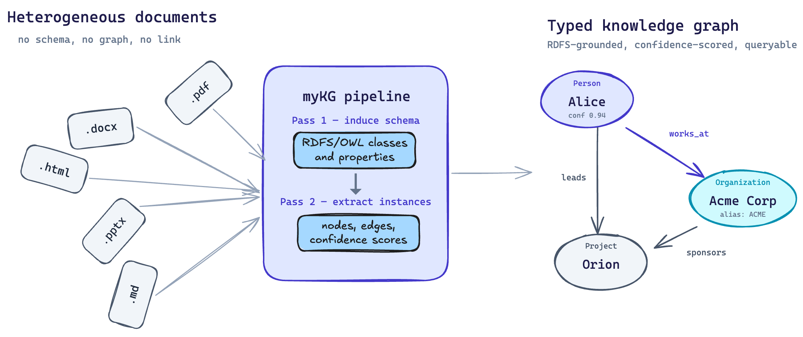
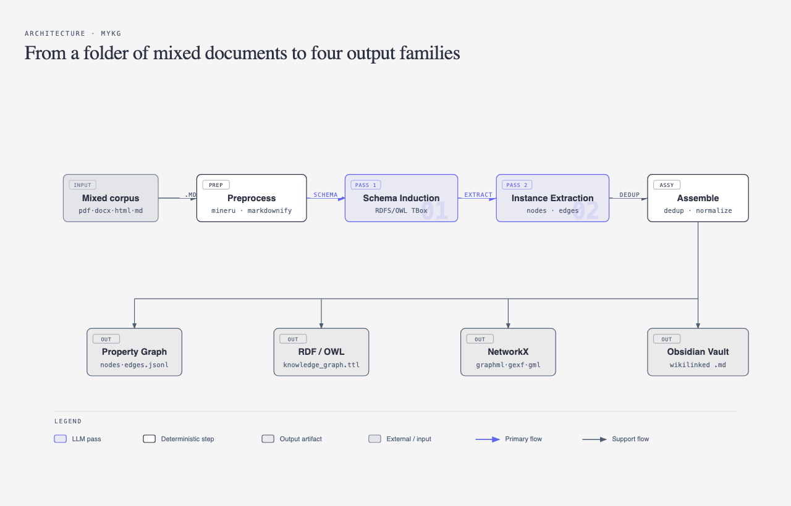

# From Documents to a Living Knowledge Graph: Introducing myKG

If you've ever stared at a folder full of PDFs, meeting notes, design docs, and half-finished Markdown files and thought *"there's a system buried in here somewhere"* — **myKG** is for you.

**myKG** is an open-source command-line tool that turns a directory of mixed documents into a confidence-scored, ontology-grounded knowledge graph. You point it at `my_notes/`, and it gives you back typed entities, typed relationships, an inferred RDFS/OWL schema, an interactive HTML graph, and an Obsidian vault your AI coding assistant can read directly.

<p align="center">
  
</p>

*The argument in one picture: heterogeneous documents in, one typed knowledge graph out. The left side is what you have today — a folder of unrelated files in five formats with no structure linking them. The right side is what **myKG** produces — typed entities (`Person: Alice`, `Organization: Acme Corp`, `Project: Orion`) connected by typed, confidence-scored relationships (`works_at`, `leads`, `sponsors`). The two LLM passes in the middle do the work.*

Just three commands:
```bash
pip install mykg
mykg init
mykg extract-graph my_notes/
```

That's the whole onboarding. Three commands and you have a graph.

The repo is [here](github.com/SenolIsci/mykg).


## The Problem It Solves

Most knowledge lives as unstructured prose scattered across formats: a PDF white paper here, a Word doc there, a Confluence export, a folder of meeting notes, a few hundred Markdown files in a personal vault. Search helps you find a document. It doesn't help you answer questions like *"who works at which company, on what project, since when, and who reports to whom?"* — the kind of questions a graph answers naturally and prose answers badly.

Building a knowledge graph by hand is brutal: you need an ontology, an entity extractor, a relationship extractor, a deduplicator, a name normalizer, an exporter, and the patience to keep all of those consistent as your corpus grows.

myKG does the whole pipeline for you, end to end, with an LLM doing the cognitive work and a deterministic Python pipeline doing the bookkeeping.

## Why I Built It

I built **myKG** because I was frustrated with the existing tools — I wanted something versatile enough to handle mixed real-world documents, grounded in a real ontology rather than a tag cloud, and tested and trustworthy enough that I could actually rely on its output instead of second-guessing every extraction.

## How It Works: Two Passes, Twelve Steps

**myKG** runs a **two-pass LLM pipeline**:

- **Pass 1 — Schema induction.** The LLM reads batched files and proposes concept types (`Person`, `Organization`, `SoftwareEngineer`), their is-a hierarchy, their attributes, and the properties that connect them (`works_at`, `manages`, `depends_on`). The result is a real RDFS/OWL ontology you can open in Protégé.
- **Pass 2 — Instance extraction.** The LLM walks each file with the schema in hand and extracts entities and relationships against it. No invented types, no surface-form chaos.

<p align="center">
  
</p>

Between and around those two passes are ten more steps that handle preprocessing, validation, name normalization, deduplication, orphan reconnection, and multi-format export. The whole pipeline is resumable — every stage persists its state to disk, so you can re-enter at any step after a crash or an edit without repeating upstream work.

## What Makes It Different

**Mixed-format input, not just Markdown.** Point **myKG** at a folder and it absorbs `.pdf`, `.docx`, `.doc`, `.pptx`, `.png`, `.jpg`, `.html`, and `.md` files. PDFs and Office documents are converted by MinerU inside an ephemeral `uv`-managed Python 3.12 venv — nothing is installed into your active environment. HTML is converted in-process by `markdownify`. The conversion is fully transparent and lands in `input/_preprocessed/` for inspection.

**A real ontology, not a tag soup.** The schema is a first-class artifact — exported as a valid RDFS/OWL Turtle file, validated by rdflib, and editable by hand. You can supply your own `--base-schema` to lock authoritative classes and properties; the LLM is allowed to extend it but not rename or contradict it. You can supply a `--thesaurus` SKOS vocabulary to give the schema merger synonym awareness beyond string matching.

**Human-in-the-loop, when you want it.** Run with `--review` and the pipeline pauses after Pass 1. Inspect `schema.json`, edit it, or load `schema.ttl` in Protégé and save back. Resume with `mykg approve-schema`. The LLM doesn't get the last word on your ontology unless you let it.

**Confidence scores everywhere.** Every attribute, node, and edge carries a `0.0–1.0` confidence score. Missing attributes are never dropped — they're recorded as `{"value": null, "confidence": 0.0}`. Downstream consumers filter by threshold instead of guessing what the LLM did or didn't see.

**Name normalization.** "Acme Corp", "ACME", and "Acme Corporation" are resolved to a single canonical node with aliases, not three ghosts of the same entity.

**Orphan reconnection.** Nodes with zero edges after Pass 2 are often legitimate but sometimes just missed. **myKG** runs a two-stage orphan pass: a co-occurrence heuristic finds candidates from the source chunks, then an LLM call confirms or rejects each one. Recovered edges are marked `"method": "orphan_inferred"` so you can tell them apart from Pass 2 extractions.

**Provider-agnostic.** Anthropic Claude, OpenAI, Ollama (local, no API key), OpenRouter, or the `claude` CLI subprocess (no API key needed beyond your Claude Pro/Max plan). Switching providers is a one-line config change.

## Four Output Families

**myKG** doesn't pick a winner for you. It writes four parallel formats from the same in-memory graph:

- **JSONL** (`nodes.jsonl`, `edges.jsonl`) — for Neo4j, Kuzu, NetworkX, custom RAG pipelines.
- **Turtle RDF** (`knowledge_graph.ttl`) — clean RDFS/OWL triples for Protégé, SPARQL endpoints (Fuseki, GraphDB, Stardog), and OWL reasoners (HermiT, Pellet).
- **NetworkX multi-format** — GraphML, GEXF, GML, JSON node-link, Pajek, edge list, adjacency list — for Gephi, yEd, Cytoscape, D3, Sigma.js.
- **Obsidian vault** — one wikilinked Markdown note per entity, grouped by concept type, with an index page that summarizes everything.

That last one is the killer feature for anyone working with AI coding assistants.

## A Second Brain for Claude Code, Cursor, and Copilot

The Obsidian vault output is more than a visualization. It's a directory of Markdown files with YAML frontmatter, attribute sections, outgoing/incoming relationship sections, and `[[wikilinks]]` to every related entity. Open it in [Obsidian](https://obsidian.md) for Graph View and backlink navigation — or, more interestingly, **point your AI coding assistant at the folder**.

```bash
mykg extract-graph ./docs/ --session my-docs-kg
# Then in Claude Code or Cursor:
# "Read sessions/my-docs-kg/output/obsidian_vault/ and tell me
#  which services depend on the auth module."
```

Claude Code, Cursor, and Copilot can read those notes as project context, traverse the wikilinks, and answer relationship questions grounded in *your* documents — not their training data, not a fuzzy embedding search, but the actual typed graph you extracted.

## Built for Real Corpora

**myKG** is designed to scale to messy, evolving collections:

- **Session isolation** — every run lives in its own timestamped folder under `sessions/`, fully self-contained.
- **Resumable from any step** — re-enter at `pass2`, `assemble`, `orphan_score`, or anywhere else; upstream work is never repeated.
- **Append mode** — add new Markdown files to an existing session without re-running Pass 1.
- **Cross-session merge** — combine two independently-built graphs into one unified knowledge graph, with full provenance tracking and a re-extraction strategy for schema deltas.
- **Walkthrough report** — every run produces a `walkthrough.md` summarizing the schema, stats, timing, and per-step outcomes.

## Try It

```bash
pip install mykg
mykg init                          # interactive: pick provider, paste API key
mykg extract-graph my_notes/       # any directory of mixed documents
open sessions/*/output/knowledge_graph.html
```

That's it. You now have a typed, confidence-scored, ontology-grounded knowledge graph of your notes — queryable from SPARQL, browsable in Obsidian, and ready to feed your AI coding assistant.

Source, docs, and roadmap: [github.com/SenolIsci/mykg](https://github.com/SenolIsci/mykg).
