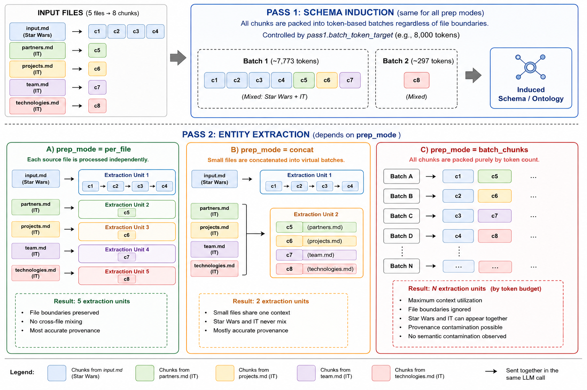
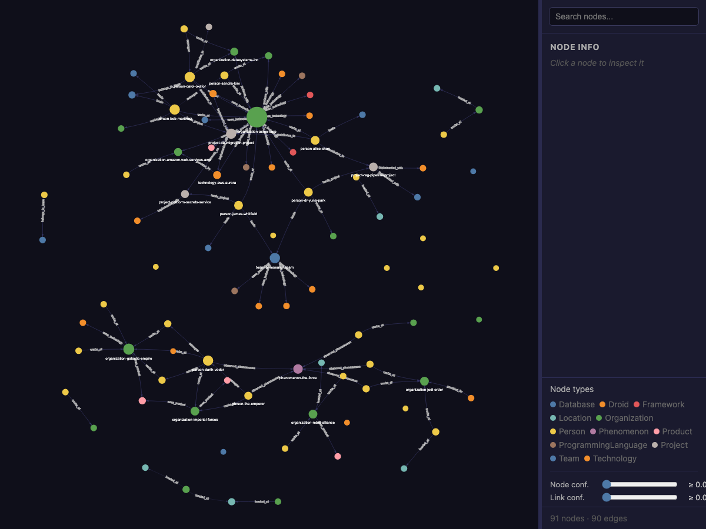
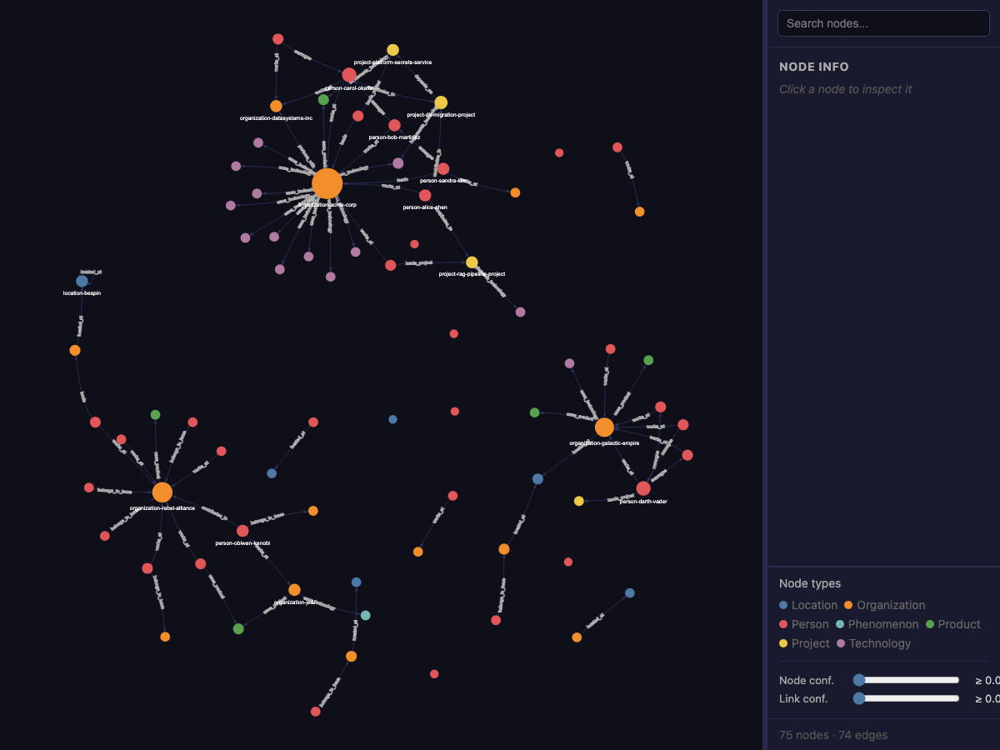
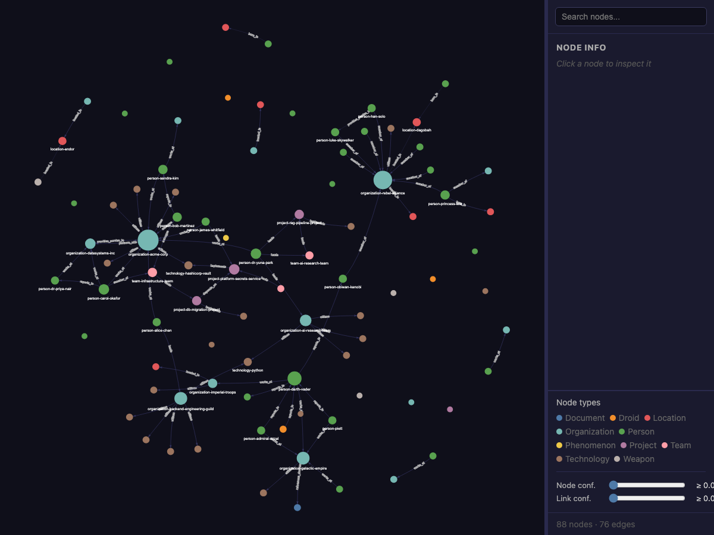

# Can an LLM Knowledge Graph Keep Two Unrelated Domains Apart?

When you feed documents from multiple unrelated domains into a knowledge graph extraction pipeline, a natural question arises: will the LLM hallucinate connections between them? If you mix a Star Wars plot summary with modern software engineering docs, will the pipeline invent a relationship between Darth Vader and your DevOps team?

## Why This Matters: The Cross-Domain Problem

In practice, knowledge graph inputs are almost never single-domain. A company wiki sits next to API documentation. A research repository holds papers from different subfields in the same folder. You rarely get to curate a clean, single-topic input directory, and pre-sorting documents by domain before extraction defeats much of the purpose of automating the process.

This creates a specific risk when the extraction pipeline is powered by an LLM. Language models are optimized to identify patterns and relationships in text. That is what makes them good at extraction: they recognize that "Alice leads the platform team" implies a `leads` relationship between a Person and a Team. But the same capability can misfire when unrelated domains share structural similarities. A fictional planet and a cloud data center region are both "locations." The concern is that an LLM, seeing these structural parallels in the same prompt, might "helpfully" bridge them.

The cost of a false cross-domain edge is asymmetric. A missing edge is an incomplete graph you can fix later. A hallucinated edge is a corrupted graph. No one notices that "Darth Vader uses_technology Kubernetes" until someone acts on it.

So the question is not just academic. For anyone building knowledge graphs from heterogeneous document collections, the answer determines whether you need to pre-sort your input by domain (expensive, manual, error-prone), maintain separate domain-specific schemas for each topic, or whether the pipeline can handle cross-domain input with a single induced schema on its own.

I put this to a small-scale test using [mykg](https://github.com/SenolIsci/mykg), processing a cross-domain corpus under three different chunking strategies. mykg is an LLM-powered knowledge graph extractor that takes document collections (Markdown, PDF, Word, Excel, HTML, images) and produces confidence-scored knowledge graphs grounded in formal ontologies. It runs a two-pass pipeline: Pass 1 induces an RDFS/OWL schema from the corpus. Pass 2 extracts typed entities and relationships against that schema, with every attribute receiving an individual confidence score.

## The Test Corpus

Five markdown files in a single directory, drawn from two completely unrelated domains:

**Domain A: Star Wars (1 file).** `input.md` contains a prose retelling of the original Star Wars trilogy. Entities include characters (Luke Skywalker, Darth Vader, Han Solo, Yoda), locations (Tatooine, the Death Star, Hoth, Endor), and organizations (the Rebel Alliance, the Galactic Empire).

**Domain B: IT Organization (4 files).** `partners.md`, `projects.md`, `team.md`, and `technologies.md` describe a fictional IT organization (Acme Corp). Entities include engineers (Alice Chen, Bob Martinez), projects (RAG Pipeline, DB Migration), and technologies (AWS Aurora, Kubernetes, PyTorch).

These two domains share zero real-world relationships. Any edge linking a Star Wars entity to an IT entity would be a hallucination.

## The Experiment

I ran mykg's `extract-graph` pipeline three times, using three batching strategies that vary in how they group document chunks before sending them to the LLM. The model was a free-tier model via OpenRouter with a 2,000-token chunk window, producing 8 chunks (4 from `input.md` (Star Wars), 1 from each IT file).

The three strategies control how those chunks get packaged into LLM calls for Pass 2 (entity extraction):

- **`per_file`** keeps each source file as its own unit. The LLM never sees text from two different files in the same prompt. This produced 5 extraction units.

- **`concat`** merges small files into virtual batches up to a token budget. The four IT files merged into one virtual batch; `input.md` (Star Wars) stayed as its own. This produced 2 extraction units. Star Wars and IT text never mix.

- **`batch_chunks`** ignores file boundaries entirely. Chunks are packed into batches purely by token count. This produced 5 batches, and Star Wars and IT chunks can end up side by side in the same LLM call.

The key variable is how much cross-file mixing each mode allows. `batch_chunks` is the most aggressive: if cross-file mixing were going to cause hallucinated cross-domain links, this mode would produce them.

*How the 5 input files flow through Pass 1 Schema Induction (same for all modes) and the three Pass 2 prep modes. Pass 1 always mixes chunks across file boundaries. Pass 2 varies from full file isolation (per_file) to full cross-file mixing (batch_chunks).*

Each run independently induced its own schema (Pass 1 Schema Induction) and then extracted entities against it (Pass 2). Pass 1 Schema Induction always mixes chunks from all files regardless of prep mode, so the LLM sees both domains during schema induction in every run. The resulting graphs varied:

| | per_file | concat | batch_chunks |
|---|---|---|---|
| Schema concepts | 13 | 8 | 10 |
| Schema properties | 14 | 13 | 13 |
| Unique nodes | 91 | 75 | 88 |
| Unique edges | 91 | 76 | 78 |
| Orphans (isolated nodes) | 26 | 18 | 29 |

The `per_file` schema was the richest (13 concepts including Technology subtypes and a Droid type). The `batch_chunks` schema induced 10 concepts covering both domains (Droid, Weapon, Phenomenon alongside Team, Technology, Project). The `concat` schema found 8 concepts without domain-specific subtypes. Schema induction is stochastic: each run produces a different ontology from the same input. If you need more control, mykg supports a `--base-schema` flag that locks in classes and properties from an existing RDFS/OWL ontology, or `--review` to inspect and edit the schema before extraction begins.

## Zero Cross-Domain Edges

In every run, the graph separates into domain-specific clusters plus scattered isolates. No edges bridge the two domains.

| Mode | SW connected | IT connected | Isolates | Cross-domain edges |
|---|---|---|---|---|
| per_file | 36 nodes | 43 nodes | 12 | **0** |
| concat | 38 nodes | 30 nodes | 7 | **0** |
| batch_chunks | 34 nodes | 37 nodes | 17 | **0** |

Zero cross-domain edges in 245 total. The pipeline kept Star Wars and IT completely separate in every run, regardless of how aggressively it mixed chunks across file boundaries.

*Per-file mode (91 nodes, 91 edges): Star Wars and IT entities form clearly separate clusters.*

*Concat mode (75 nodes, 76 edges): two clean domain clusters.*

*Batch-chunks mode (88 nodes, 78 edges): despite chunks from both domains sharing batches, no cross-domain edges appear.*

## Why the Separation Works

The zero cross-domain result comes from three reinforcing mechanisms.

### The typed schema acts as a structural guardrail

mykg's Pass 1 Schema Induction induces typed concepts and typed relationships before extraction begins. The relationship types constrain which edges are possible. `observed_phenomenon` connects Persons to Phenomena. `uses_technology` connects Organizations to Technologies. There is no relationship type connecting a Droid to a Project or a Phenomenon to a Technology.

Even if the LLM wanted to hallucinate a link between Darth Vader and Pinecone, it would need a relationship type connecting Person to Technology. The schema includes `uses_technology`, but its domain is Organization, not Person. Hallucinations that violate the type system are rejected before they reach the graph.

The batch_chunks schema (10 concepts) included both Star Wars-specific types (Droid, Weapon, Phenomenon) and IT-specific types (Team, Technology, Project). With both domain-specific *and* shared types available, the LLM had ample opportunity to create cross-domain relationships. It did not.

### Model behavior and post-processing hold the line

The LLM received no explicit instruction to keep domains separate, yet correctly scoped extraction to the entities in each chunk. Even in `batch_chunks` mode, where both domains appear in the same prompt, it did not attempt to link them.

The post-processing steps also held. Deduplication merges entities by ID and name, and since no entity name appears in both domains, no cross-domain merges occurred. Orphan recovery to connect isolated nodes only proposes edges between entities that co-occur in the same source chunk, and since the two domains do not share chunks, there is no co-occurrence signal to exploit. These steps recovered 8 to 13 orphan edges per run, all within-domain.

Whether this holds for *partially* related domains (two overlapping medical specialties, or two competing companies in the same industry) is an open question this test does not answer.

## What This Means

The pipeline keeps unrelated domains apart through the typed schema, the model's semantic understanding, and co-occurrence-based post-processing. These three layers reinforce each other: even if one were to fail, the others would likely catch the error.

In this trial run, the concern that cross-domain input would lead to hallucinated cross-domain links did not materialize. This was a small-scale trial with five files, two clearly distinct domains, and a free-tier model. For further work, it would be worth testing whether the same separation holds at production scale with hundreds of files, partially overlapping domains, and frontier models that may be more aggressive about inferring implicit connections.

---

## References

1. Lavrinovics, E., Biswas, R., Bjerva, J., & Hose, K. (2024). Knowledge Graphs, Large Language Models, and Hallucinations: An NLP Perspective. *Semantic Web Journal*. [doi:10.3233/SW-243602](https://www.sciencedirect.com/science/article/pii/S1570826824000301)

2. Belova, M., Xiao, J., Tuli, S., & Jha, N. K. (2024). GraphMERT: Efficient and Scalable Distillation of Reliable Knowledge Graphs from Unstructured Data. *arXiv:2510.09580*. [arxiv.org/abs/2510.09580](https://arxiv.org/abs/2510.09580)

3. Sun, Q., Luo, Y., Zhang, W., Li, S., Li, J., Niu, K., Kong, X., & Liu, W. (2024). Docs2KG: Unified Knowledge Graph Construction from Heterogeneous Documents Assisted by Large Language Models. *arXiv:2406.02962*. [arxiv.org/abs/2406.02962](https://arxiv.org/abs/2406.02962)

4. Biswas, R., et al. (2024). Construction of Knowledge Graphs: Current State and Challenges. *Information*, 15(8), 509. [doi:10.3390/info15080509](https://www.mdpi.com/2078-2489/15/8/509)

5. Papanikolaou, Y., et al. (2025). Knowledge Graph Construction: Extraction, Learning, and Evaluation. *Applied Sciences*, 15(7), 3727. [doi:10.3390/app15073727](https://www.mdpi.com/2076-3417/15/7/3727)
